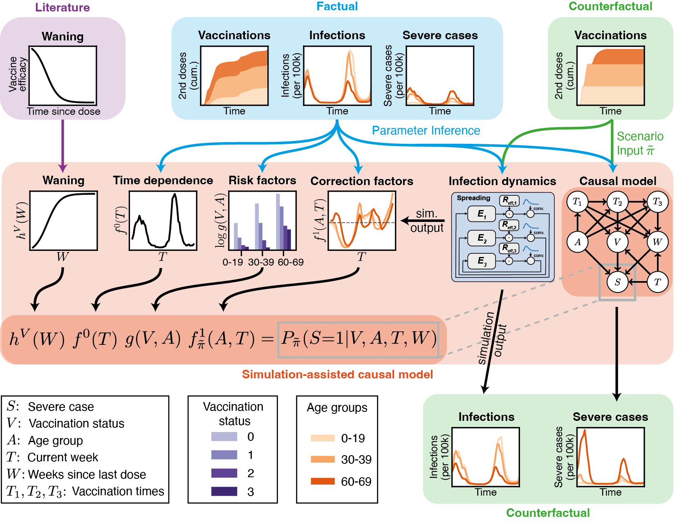

# Evaluating vaccine allocation strategies using simulation-assisted causal modelling

[](https://github.com/psf/black)
[](https://opensource.org/licenses/BSD-3-Clause)



## Installation

The infection dynamics simulation code is included as a submodule. Clone this repository and initialize submodules with
```bash
git clone git@github.com:akekic/covid-vaccine-evaluation.git
cd covid-vaccine-evaluation
git submodule init
git submodule update 
```
The inferred parameters for the infection dynamics simulation is stored here. 
Download the data and place it in the corresponding data folder with
```bash
cd covid-vaccine-dynamics/data/traces
wget https://gin.g-node.org/jdehning/covid-vaccine-dynamics-data/raw/488d5b6235be00e37c872ced080af713cdf92d1d/traces/run-begin=2020-12-20-end=2021-12-19-C_mat=70-V1_eff=70-V2_eff=90-V3_eff=95-influx=0.5-draws=500.pkl
wget https://gin.g-node.org/jdehning/covid-vaccine-dynamics-data/raw/488d5b6235be00e37c872ced080af713cdf92d1d/traces/run-begin=2020-12-20-end=2021-12-19-C_mat=80-V1_eff=70-V2_eff=90-V3_eff=95-influx=0.5-draws=500.pkl
wget https://gin.g-node.org/jdehning/covid-vaccine-dynamics-data/raw/488d5b6235be00e37c872ced080af713cdf92d1d/traces/run-begin=2020-12-20-end=2021-12-19-C_mat=90-V1_eff=70-V2_eff=90-V3_eff=95-influx=0.5-draws=500.pkl
cd ../../..
``` 
Install the submodule with
```bash
pip install -e ./covid-vaccine-dynamics
```
Install the main package with
```bash
pip install -e .
```

Convert all notebook files into `.ipynb`

```bash
jupytext notebooks/*.py --to .ipynb
jupytext data_preprocessing/*.py --to .ipynb
```

The entire installation process can take up to 2 hours, mostly depending on how fast the data can be downloaded.

The `requirements.txt` file contains all the required packages without pinned versions.
One tested set of versions is (including requirements of the submodule):
```
arviz==0.12.1
cachetools==4.2.4
CairoSVG==2.5.2
ConfigArgParse==1.5.3
covid19-inference==0.3.6
filelock==3.8.0
jupytext==1.14.1
matplotlib==3.5.3
notebook==6.4.12
numpy==1.21.6 
numpyro==0.10.1
pandas==1.4.4
pymc3==3.11.2
pytest==7.1.3
requests==2.28.1
statsmodels==0.13.2
tabulate==0.8.10
tqdm==4.64.1
xarray==0.19.0
```

## Data preparation

The raw input data is stored under `data/input-data`.
The data is prepared with the script `data_preprocessing/israel_data_processing.py`.
The script is run with
```bash
cd data_preprocessing
python israel_data_processing.py
```
This creates two pickled dataframes in `data/preprocessed_data`:
- `israel_df.pkl`,
- `israel_constants.pkl`.

We then estimate the severity factorisation
```bash
python severity_factorisation.py
cd ..
```

This creates the severity factorisation for different assumed waning timescales:
- regular waning: `data/factorisation-with-fit`
- fast waning: `data/factorisation-with-fit-fast-waning`
- no waning: `data/factorisation-with-fit-no-waning`.


## Hello world

To run a scenario run the main script with
```bash 
python main.py --config=configs/<VACCINE_ALLOCATION_STRATEGY>.yml
```
where `<VACCINE_ALLOCATION_STRATEGY>` is one of the following:
- `observed`,
- `uniform`,
- `young-first`,
- `elderly-first`.

This saves the results in `run/YYYY-MM-DD_HH-MM-SS_<VACCINE_ALLOCATION_STRATEGY>/`.
The run output file format is shown [here](#run-output-files).

## Reproduce results
### Counterfactual vaccine allocation strategies

To reproduce the results for the different vaccine allocation strategies run
```bash
python experiments/policy_exp.py --config configs/policy-exp.yml
```
which saves the results in `run/YYYY-MM-DD_HH-MM-SS.FFFFFF_policy_exp/`.
The run can be analysed with the notebook`notebooks/va_strategy_experiment_analysis.ipynb`.
Runtime: 5.5 hours (using 64 cores), 44 hours (on regular PC, estimated assuming 8 cores).

### Impact of vaccine uptake

Run
```bash
python experiments/vaccine_acceptance_exp.py --config configs/vaccine-acceptance-exp.yml
```
which saves the results in `run/YYYY-MM-DD_HH-MM-SS.FFFFFF_acc_exp/`.
The run can be analysed with the notebook`notebooks/uptake_experiment_analysis.ipynb`.
Runtime: 13 hours (using 64 cores), 104 hours (on regular PC, estimated assuming 8 cores).

### Simulating other disease types

Run
```bash
python experiments/risk_profile_exp.py --config configs/risk-profile-exp.yml
```
which saves the results in `run/YYYY-MM-DD_HH-MM-SS.FFFFFF_risk_profile_exp/`.
The run can be analysed with the notebook`notebooks/risk_profile_experiment_analysis.ipynb`.
Runtime: 17 hours (using 64 cores), 136 hours (on regular PC, estimated assuming 8 cores).

### Impact of immunity waning

Run
```bash
python experiments/waning_exp.py --config configs/waning-exp.yml
```
which saves the results in `run/YYYY-MM-DD_HH-MM-SS.FFFFFF_waning_exp/`.
The run can be analysed with the notebook`notebooks/waning_experiment_analysis.ipynb`.
Runtime: 11 hours (using 64 cores), 88 hours (on regular PC, estimated assuming 8 cores).

## Run output files

```bash
run_output_directory
├── result.npy
├── result_samples.npy
├── factorisation_data
│   ├── observed_infection_data.csv
│   ├── observed_severity_data.csv
│   ├── population_data.csv
│   ├── risk_factors.csv
│   ├── time_dependence.csv
│   ├── vaccination_data.csv
│   ├── vaccine_acceptance_data.csv
│   ├── vaccine_efficacy_waning_data.csv
│   └── waning_curve.csv
├── factorisation_data
│   ├── age_group_names.npy
│   ├── age_groups.npy
│   ├── D_a.npy
│   ├── observed_vaccinations.npy
│   ├── P_a.npy
│   ├── P_t.npy
│   ├── vaccination_statuses.npy
│   ├── week_dates.npy
│   ├── week_dates_scenario.npy
│   ├── weeks.npy
│   ├── weeks_extended.npy
│   ├── weeks_scenario.npy
│   └── weeks_scenario_extended.npy
├── severity_factorisation
│   ├── f_0.npy
│   ├── f_1.npy
│   ├── g.npy
│   ├── infection_dynamics.csv
│   ├── infection_dynamics_samples.npy
│   ├── median_weekly_base_R_t.npy
│   ├── median_weekly_eff_R_t.npy
│   └── vaccine_efficacy_params.npy
└── vaccination_policy
    ├── U_2.npy
    ├── U_2_full.npy
    ├── u_3.npy
    └── u_3_full.npy

```


